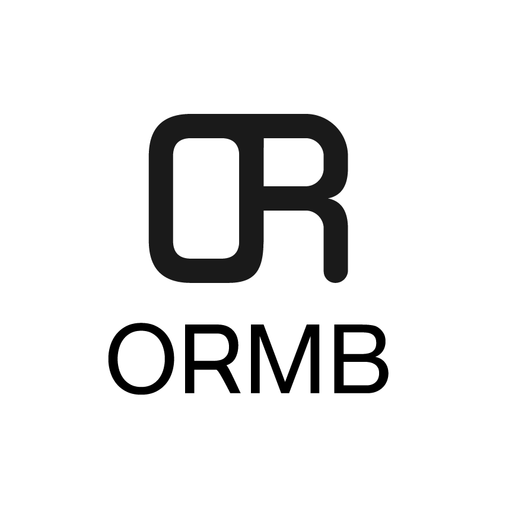

<p align="center">

</p>


[](https://travis-ci.com/kleveross/ormb)
[](https://coveralls.io/github/kleveross/ormb?branch=master)

[English](./README.md) | 中文

`ORMB` 是一个用于管理机器学习模型的开源模型仓库。

`ORMB` 通过镜像仓库来分发模型，可以帮助用户更好的管理他们的机器学习 / 深度学习模型。通过 `ORMB`，模型能更易于创建、版本化、共享以及发布。

## 入门指南

您可以查看我们的使用示例视频或阅读下面的文字版说明。

[](https://asciinema.org/a/345812)

打开本地满足 `ORMB` 规范的模型文件夹（有关 `ormbfile.yaml` 的说明详见 [文档](/docs/docs_zh/README.md#什么是-ormbfile？)）：

```bash
# 查看本地文件目录结构
$ tree examples/SavedModel-fashion
examples/SavedModel-fashion
├── model
│   ├── saved_model.pb
│   └── variables
│       ├── variables.data-00000-of-00001
│       └── variables.index
├── ormbfile.yaml
└── training-serving.ipynb

2 directories, 5 files
```

接下来，我们可以将在本地训练好的模型推送到远端镜像仓库中：

```bash
# 将模型保存在本地文件系统的缓存中
$ ormb save gaocegege/fashion_model:v1
ref:       gaocegege/fashion_model:v1
digest:    6b08cd25d01f71a09c1eb852b3a696ee2806abc749628de28a71b507f9eab996
size:      162.1 KiB
format:    SavedModel
v1: saved

# 将保存在缓存中的模型推送到远端仓库中
$ ormb push gaocegege/fashion_model:v1
The push refers to repository [gaocegege/fashion_model]
ref:       gaocegege/fashion_model:v1
digest:    6b08cd25d01f71a09c1eb852b3a696ee2806abc749628de28a71b507f9eab996
size:      162.1 KiB
format:    SavedModel
v1: pushed to remote (1 layer, 162.1 KiB total)
```

以 [Harbor](https://github.com/goharbor/harbor) 为例，在 Harbor 镜像仓库中，我们可以看到这一模型的元数据等。

<p align="center">

</p>

随后，我们可以在服务器上将模型下载下来。下载的过程也与推送到镜像仓库的方法类似。

```bash
# 从远端仓库拉取到服务器的本地缓存
$ ormb pull gaocegege/fashion_model:v1
v1: Pulling from gaocegege/fashion_model
ref:     gaocegege/fashion_model:v1
digest:  6b08cd25d01f71a09c1eb852b3a696ee2806abc749628de28a71b507f9eab996
size:    162.1 KiB
Status: Downloaded newer model for gaocegege/fashion_model:v1

# 将本地缓存的模型导出到当前目录
$ ormb export gaocegege/fashion_model:v1
ref:     localhost/gaocegege/fashion_model:v1
digest:  6b08cd25d01f71a09c1eb852b3a696ee2806abc749628de28a71b507f9eab996
size:    162.1 KiB

# 查看本地文件目录结构
$ tree examples/SavedModel-fashion
examples/SavedModel-fashion
├── model
│   ├── saved_model.pb
│   └── variables
│       ├── variables.data-00000-of-00001
│       └── variables.index
├── ormbfile.yaml
└── training-serving.ipynb

2 directories, 5 files
```

## 安装

### 安装镜像仓库

`ORMB` 使用镜像仓库存储模型，您可以选择 [安装 Harbor](https://github.com/goharbor/harbor-helm) 或者 [使用 Docker Registry](https://docs.docker.com/registry/deploying/)。此处推荐使用 Harbor。

### 安装 `ORMB`

您可以安装预编译的二进制文件，或是从源代码进行编译。

#### 安装二进制文件

从 [releases](https://github.com/kleveross/ormb/releases) 页面中下载预编译的二进制文件并且将其复制到所需的位置。

#### 从源代码编译

下载源码:

```
$ git clone https://github.com/kleveross/ormb
$ cd ormb
```

安装依赖:

```
$ go mod tidy
```

编译:

```
$ make build-local
```

验证运行:

```
$ ./bin/ormb --help
```

## 深入了解

### 为什么选择 `ORMB`？

详见 [`ormb` 介绍](/docs/docs_zh/introduction.md)。

### 官方文档

详见 [`ormb` 文档](/docs/docs_zh/README.md)

### 使用教程

* 使用 `ormb` 和 Docker 镜像仓库分发模型：[tutorial.md](docs/tutorial.md)
* 使用 `Seldon Core` 启动模型服务：[tutorial-serving-seldon.md](docs/tutorial-serving-seldon.md)

### OCI 模型配置规范

请查阅 [spec_v1alpha1.md](docs/spec-v1alpha1.md)

## 社区

`ormb` 是 Klever 云原生机器学习平台的子项目。

Klever 的 Slack 是 klever.slack.com，请点击 [邀请链接](https://join.slack.com/t/kleveross/shared_invite/zt-g0eoiyq9-9OwiI7c__oV79bh_94MyTw) 加入 Slack 讨论。
