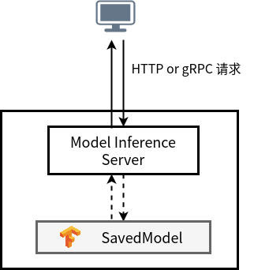
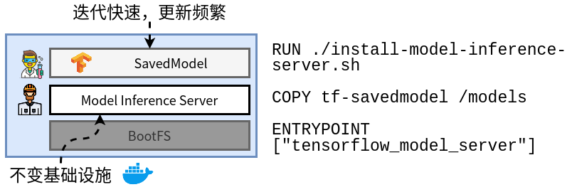
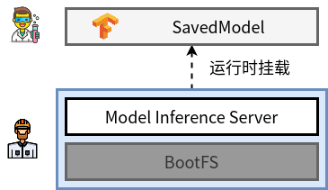
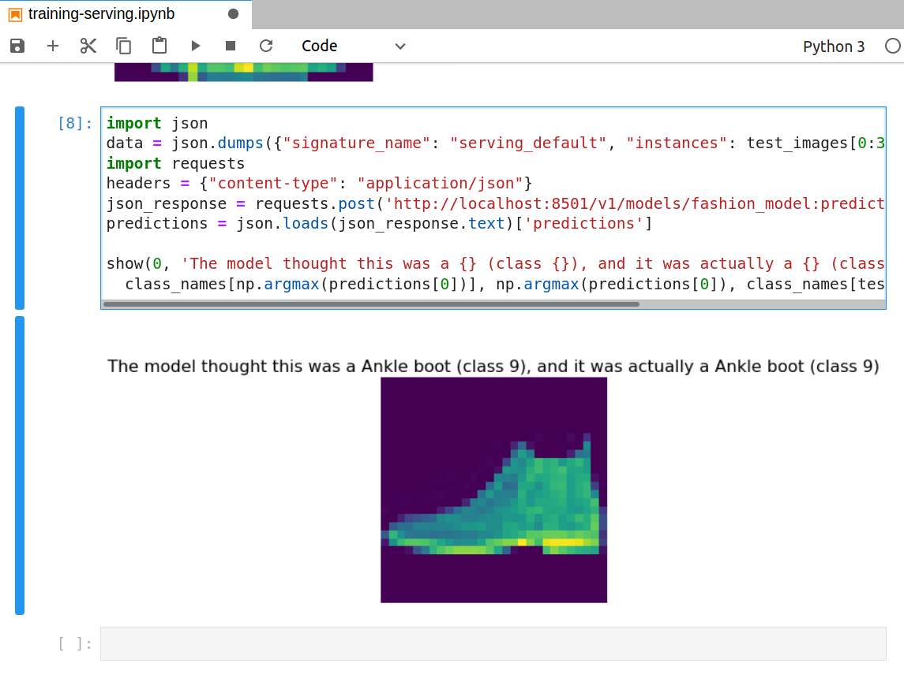
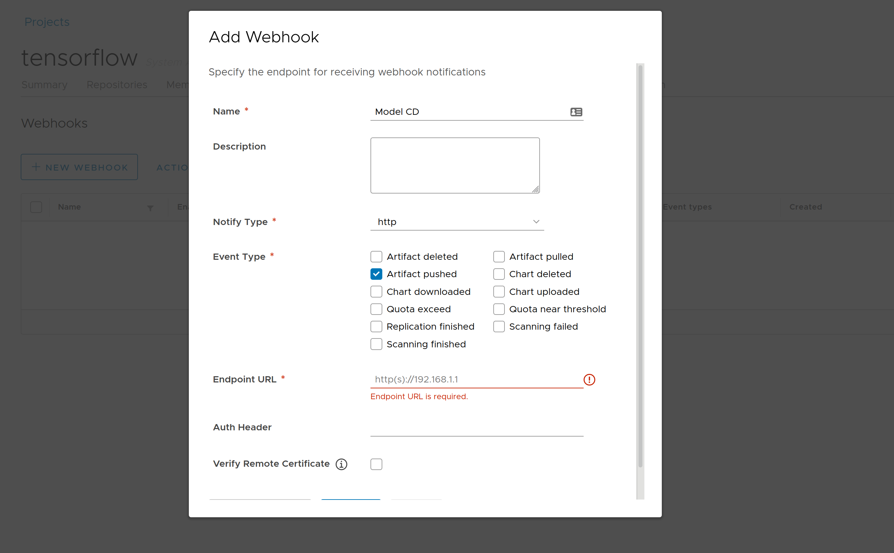
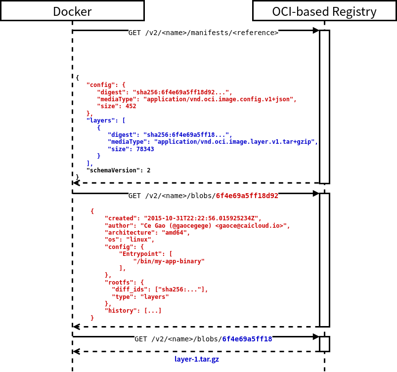

# ormb 介绍

以 Docker 为代表的容器虚拟化技术，业已成为云计算的中流砥柱。世界各地的软件工程师们纷纷成为了它的拥趸。以 Open Container Initiative 作为基础，容器的生态迅速演化。Docker Compose，Kata Containers 等项目百花齐放，Kubernetes 更是成为了集群调度领域的事实标准。

回过头看，以 Docker 为代表的容器虚拟化技术，能够以雷霆万钧之势席卷世界，最大的依仗当属其镜像分发能力。这是其他技术一直以来不曾解决的问题，也是在应用部署场景下，一直以来引人诟病的问题。Docker 把 Build Once, Deploy Anywhere 的能力带给了传统应用场景。Java、NodeJS、Rust 等等各种各样的语言，各种各样的依赖库，都可以在本地一次构建成符合 OCI 规范的容器镜像，随后利用镜像仓库进行存储和分发。

Docker 很好地解决了传统应用分发的问题，那么在机器学习场景下，我们是否需要分发的能力？

## 为什么需要分发模型

机器学习场景与传统的应用场景相比，存在一定的差异，也正是这些差异导致了对分发能力的要求有一些偏差。在传统应用的场景下，需要分发的通常是二进制可执行程序，或者带有语言解释器的脚本代码，或者是带着语言虚拟机的字节码。而且，对于传统应用的场景，通常开发团队迭代的是代码，同一个版本的代码多次编译出来的输出工件是一致的。

而在机器学习场景下，情况就有些不同了。当我们需要部署机器学习应用时，一般情况下我们需要一个模型推理服务器（也被称作模型服务器），以及被部署的模型。模型服务器之于机器学习应用，就好比 Tomcat 之于 Java Web 应用。机器学习模型本身只是模型的权重和结构等信息的集合，并不能直接对外提供服务。它需要通过一个服务器，对外提供 RESTful 或者基于 gRPC 的服务。这个服务器就是模型服务器。调用方的请求会首先到达模型服务器，随后模型服务器会利用模型进行前向计算，并且将结果作为响应返回给调用方。

<p align="center">

</p>

如下图所示，当我们想要在生产环境利用云原生的技术部署模型服务时，通常在开始时，出于简单方便的考虑，会将模型服务器与模型文件打包成一个镜像，同时复用镜像分发的能力来实现对模型的分发。

<p align="center">

</p>

这样的做法存在一些问题：

- 模型服务器本身属于不可变的基础设施，在业务中通常会由基础设施团队维护或者直接采用开源的模型服务器。而模型服务器本身通常是非常重的，以 [Nvidia Triton Inference Server](https://github.com/NVIDIA/triton-inference-server) 20.03 版本为例，它的镜像有 43 层，解压后的大小有 6.3G。因此将模型服务器和模型文件一同打包，非常容易出现超大镜像。在镜像 P2P 分发还没有广泛落地的当下，不易于维护和分发。
- 另外，模型的更新是非常频繁的。如果这一打包过程不能自动化，需要算法工程师参与，成本会难以控制。
- 最后，由于镜像不能保存模型的元数据，这种方式不能很好地横向扩展。随着模型和版本的增多，对于多模型和多版本的管理，会相当麻烦。模型的超参数、训练指标、存储格式等元数据的缺失会加剧这一问题。

随着规模的发展，模型服务器（如[Nvidia Triton Inference Server](https://github.com/NVIDIA/triton-inference-server)、[ONNX Runtime](https://github.com/microsoft/onnxruntime) 等）可以被当做是底层的“运行时”，是不变的基础设施。模型服务器可以以 Docker 镜像的方式分发。而模型，可以类比为是在运行时上运行的脚本代码。它可以被模型服务器容器在运行时通过挂载的方式进入容器。这使得我们可以解耦模型服务器和模型本身，基础设施团队可以分发模型服务器镜像，而算法团队只需要分发模型即可。

<p align="center">

</p>

## State of the Art

既然在机器学习场景下，模型的分发是我们关注的特性，那么这一特性也一定是不少模型仓库项目想要提供的。目前在业界，模型的分发问题主要有两类实现思路。

第一个方向是以 [Caicloud Clever](https://caicloud.io/products/clever) 第一代模型仓库为代表的维护自有存储的实现。用户需要通过 SDK 或者 UI 的方式，上传模型到模型仓库中。在模型上传后，模型仓库会将模型和模型的元数据存储在自身维护的存储后端中。在用户需要利用模型进行推理时，需要再利用模型仓库提供的 SDK 或者接口将模型下载下来，进行推理服务。

另外一个方向，是以 [ModelDB](https://github.com/VertaAI/modeldb) 为代表的实现。在这种实现中，模型仓库并不真正存储模型，而只存储模型的元数据。模型本身通过借助第三方的对象存储，如 MinIO，S3 等实现。模型存储的路径作为元数据之一，被模型仓库管理。在需要下载模型时，可以利用第三方的对象存储提供的 SDK 或者接口进行下载。

这两个方式各有优劣：前者可以更好地进行模型的权限控制，但是引入了私有的 SDK 和接口来进行模型的上传与下载，对用户而言有一定的学习成本。

后者利用成熟的第三方存储进行模型文件的保存，学习成本较低。但是元数据与模型分离的实现使得权限控制非常困难。用户通过第三方存储的 SDK 或者接口可以绕过模型仓库直接对模型文件进行下载。除此之外，两种方式都需要自己造轮子，来实现对模型的元数据和模型文件的处理逻辑。

那么，有没有结合两种实现的优点，同时又可以规避它们的缺点的设计方案呢？

## 利用镜像仓库分发机器学习模型

我们把目光投向了镜像仓库，镜像仓库已经是云原生时代的一个至关重要的基础设施了。它为容器镜像提供了标准化的分发能力，如果能够复用镜像仓库的能力来分发模型，这样不仅避免了重复造轮子，同时可以提供类似于 `docker pull` 与 `docker push` 的使用体验，对用户而言没有过多的学习成本。

于是，[ormb][] 应运而生。[ormb][]（哦，人民币）的名称源自 OCI-Based Registry for ML/DL Model Bundle，它能够将模型和模型的元数据利用已有的镜像仓库进行分发。

### 端到端的示例

接下来，我们以图像识别作为示例，介绍一下如何利用 [ormb][] 进行机器学习模型的分发。

在这一示例中，我们会在本地利用 [Fashion MNIST](https://github.com/zalandoresearch/fashion-mnist) 训练一个简单的 CNN 图像识别模型，并且利用 [ormb][] 将其推送到远端的镜像仓库中。随后，在服务器上我们同样利用 [ormb][] 将模型拉取下来，并且利用第三方的模型服务器对外提供服务。随后我们利用 RESTful 的接口调用这一服务，查看结果。

模型训练的代码如下所示，具体训练过程不再赘述，最后我们将训练好的模型保存为 SavedModel 格式。我们将模型提供在了 [ormb 的示例中](https://github.com/caicloud/ormb/tree/master/examples/SavedModel-fashion)。

```python
# 建立模型，设定 Optimizer，进行训练
model = keras.Sequential([
  keras.layers.Conv2D(input_shape=(28,28,1), 
                      filters=8, 
                      kernel_size=3, 
                      strides=2, 
                      activation='relu', 
                      name='Conv1'),
  keras.layers.Flatten(),
  keras.layers.Dense(10, 
                     activation=tf.nn.softmax, 
                     name='Softmax')
])
model.compile(optimizer='adam', 
              loss='sparse_categorical_crossentropy',
              metrics=['accuracy'])
model.fit(train_images, train_labels, epochs=epochs)

test_loss, test_acc = model.evaluate(test_images, 
                                     test_labels)
import tempfile

# 保存模型到当前目录的 model 子目录下
MODEL_DIR = "./model"
version = 1
export_path = os.path.join(MODEL_DIR, str(version))
tf.keras.models.save_model(
    model,
    export_path,
    overwrite=True,
    include_optimizer=True,
    save_format=None,
    signatures=None,
    options=None
)
```

接下来，我们可以将在本地训练好的模型推送到远端镜像仓库中：

```bash
# 将模型保存在本地文件系统的缓存中
$ ormb save ./model gaocegege/fashion_model:v1
ref:       gaocegege/fashion_model:v1
digest:    6b08cd25d01f71a09c1eb852b3a696ee2806abc749628de28a71b507f9eab996
size:      162.1 KiB
format:    SavedModel
v1: saved
# 将保存在缓存中的模型推送到远端仓库中
$ ormb push gaocegege/fashion_model:v1
The push refers to repository [gaocegege/fashion_model]
ref:       gaocegege/fashion_model:v1
digest:    6b08cd25d01f71a09c1eb852b3a696ee2806abc749628de28a71b507f9eab996
size:      162.1 KiB
format:    SavedModel
v1: pushed to remote (1 layer, 162.1 KiB total)
```

以 Harbor 为例，在 Harbor 镜像仓库中，我们可以看到这一模型的元数据等。

<p align="center">

</p>

随后，我们可以在服务器上将模型下载下来。下载的过程也与推送到镜像仓库的方法类似。

```bash
# 从远端仓库拉取到服务器的本地缓存
$ ormb pull gaocegege/fashion_model:v1
v1: Pulling from gaocegege/fashion_model
ref:     gaocegege/fashion_model:v1
digest:  6b08cd25d01f71a09c1eb852b3a696ee2806abc749628de28a71b507f9eab996
size:    162.1 KiB
Status: Downloaded newer model for gaocegege/fashion_model:v1
# 将本地缓存的模型导出到当前目录
$ ormb export gaocegege/fashion_model:v1
ref:     localhost/gaocegege/fashion_model:v1
digest:  6b08cd25d01f71a09c1eb852b3a696ee2806abc749628de28a71b507f9eab996
size:    162.1 KiB
$ tree ./model
model
└── 1
    ├── saved_model.pb
    └── variables
        ├── variables.data-00000-of-00001
        └── variables.index

2 directories, 3 files
```

接下来，我们就可以利用 TFServing 将模型部署为 RESTful 服务，并且利用 Fashion MNIST 数据集的数据进行推理。

```bash
$ tensorflow_model_server --model_base_path=$(pwd)/model --model_name=fashion_model --rest_api_port=8501
2020-05-27 17:01:57.499303: I tensorflow_serving/model_servers/server.cc:358] Running gRPC ModelServer at 0.0.0.0:8500 ...
[evhttp_server.cc : 238] NET_LOG: Entering the event loop ...
2020-05-27 17:01:57.501354: I tensorflow_serving/model_servers/server.cc:378] Exporting HTTP/REST API at:localhost:8501 ...
```

<p align="center">

</p>

或者，我们也可以使用 Seldon Core 将模型服务直接部署在 Kubernetes 集群上，具体可以参见我们[提供的文档](https://github.com/caicloud/ormb/blob/master/docs/tutorial-serving-seldon.md)。

```yaml
apiVersion: machinelearning.seldon.io/v1alpha2
kind: SeldonDeployment
metadata:
  name: tfserving
spec:
  name: mnist
  protocol: tensorflow
  predictors:
  - graph:
      children: []
      implementation: TENSORFLOW_SERVER
      modelUri: demo.goharbor.io/tensorflow/fashion_model:v1
      serviceAccountName: ormb
      name: mnist-model
      parameters:
        - name: signature_name
          type: STRING
          value: predict_images
        - name: model_name
          type: STRING
          value: mnist-model
    name: default
    replicas: 1
```

当算法工程师迭代了新版本的模型时，可以打包新的版本，利用 [ormb][] 拉取新的镜像后重新部署。[ormb][] 可以配合任何符合 [OCI Distribution Specification](https://github.com/opencontainers/distribution-spec) 的镜像仓库使用，这意味着 [ormb][] 支持公有云上的镜像仓库，和 Harbor 等开源镜像仓库项目。

我们也可以利用 Harbor 提供的 Webhook 功能，实现模型服务的持续部署。通过在 Harbor UI 中注册一个 Webhook，所有对 Harbor 的推送模型请求事件都会被转发到我们定义的 HTTP Endpoint 上。而我们可以在 Webhook 中实现对应的部署逻辑，比如根据新的模型来更新 Seldon 部署模型服务的版本，实现模型服务的持续部署等。

<p align="center">

</p>

## 系统设计

一言以蔽之，[ormb][] 的设计目标是机器学习场景下的 Docker，想解决的是机器学习模型的分发问题。在实现上，[ormb][] 也站在了 [OCI Artifacts](https://github.com/opencontainers/artifacts)、[OCI Distribution Specification](https://github.com/opencontainers/distribution-spec) 和 [Harbor](https://github.com/goharbor/harbor) 等巨人的肩膀上。

### Docker Pull 发生了什么

在介绍设计之前，先让我们来了解一下，当我们下载一个容器镜像时，到底发生了什么。对于符合 OCI 规范的镜像仓库而言，它们都遵循着同样的规范，这一规范就是 [OCI Distribution Specification](https://github.com/opencontainers/distribution-spec/blob/master/spec.md#pulling-an-image)。

<p align="center">

</p>

首先，Docker 会先向镜像仓库请求镜像的 Manifest。Manifest 是一个 JSON 文件，其定义包括两个部分，分别是 [Config](https://github.com/opencontainers/image-spec/blob/master/config.md) 和 [Layers](https://github.com/opencontainers/image-spec/blob/master/layer.md)。Config 是一个 JSON 对象，Layers 是一个由 JSON 对象组成的数组。可以看到，Config 与 Layers 中的每一个对象的结构相同，都包括三个字段，分别是 digest、mediaType 和 size。其中 digest 可以理解为是这一对象的 ID。mediaType 表明了这一内容的类型。size 是这一内容的大小。

容器镜像的 Config 有着固定的 mediaType `application/vnd.oci.image.config.v1+json`。一个 Config 的示例配置如下，它记录了关于容器镜像的配置，可以理解为是镜像的元数据。通常它会被镜像仓库用来在 UI 中展示信息，以及区分不同操作系统的构建等。

```json
{
    "created": "2015-10-31T22:22:56.015925234Z",    "architecture": "amd64",
    "os": "linux",
    "config": {
        "Entrypoint": [
            "/bin/my-app-binary"
        ],
    },
    "rootfs": {
      "diff_ids": [
        "sha256:c6f988f4874bb0add23a778f753c65efe992244e148a1d2ec2a8b664fb66bbd1",
        "sha256:5f70bf18a086007016e948b04aed3b82103a36bea41755b6cddfaf10ace3c6ef"
      ],
      "type": "layers"
    },
    "history": [
      {
        "created": "2015-10-31T22:22:54.690851953Z",
        "created_by": "/bin/sh -c #(nop) ADD file:a3bc1e842b69636f9df5256c49c5374fb4eef1e281fe3f282c65fb853ee171c5 in /"
      },
      {
        "created": "2015-10-31T22:22:55.613815829Z",
        "created_by": "/bin/sh -c #(nop) CMD [\"sh\"]",
        "empty_layer": true
      }
    ]
}
```

而容器镜像的 Layers 是由多层 mediaType 为 `application/vnd.oci.image.layer.v1.*`（其中最常见的是 `application/vnd.oci.image.layer.v1.tar+gzip`) 的内容组成的。众所周知，容器镜像是分层构建的，每一层就对应着 Layers 中的一个对象。

容器镜像的 Config，和 Layers 中的每一层，都是以 Blob 的方式存储在镜像仓库中的，它们的 digest 作为 Key 存在。因此，在请求到镜像的 Manifest 后，Docker 会利用 digest 并行下载所有的 Blobs，其中就包括 Config 和所有的 Layers。

更多的解释可以参见 [Docker 容器镜像是怎样炼成的？ ](https://mp.weixin.qq.com/s?__biz=Mzg3ODAzMTMyNQ==&mid=2247486285&idx=1&sn=42a8ec6caef52606b52e2f52bcb4c4a4&chksm=cf18b3fff86f3ae91364c2550a2388a12753b487ece57062f5c8a0e0e0128bc7b04b7c744612&mpshare=1&scene=1&srcid=&sharer_sharetime=1592534888462&sharer_shareid=398b8cdf40a05ba26d3dd04ea2871de0&exportkey=ATl%2F7vtmgPmdXxZu9m8Keoo%3D&pass_ticket=ueO%2Blu33I8%2FugN7BWl3s2elMGGjKsUSHTOptrPOvggpFPexr9IOFFwVErwhEniVu#rd)一文

### 镜像仓库又该如何支持模型分发

在上述的介绍中，我们可以看到，镜像仓库对于镜像的支持，通过定义了 Manifest、mediaType 为 `application/vnd.oci.image.config.v1+json` 的 Image Config 和 mediaType 为 `application/vnd.oci.image.layer.v1.*` 的 Layers 来实现的。

而随着云原生的开疆扩土，除了容器镜像之外，也有很多其他类型的工件，如 [Helm Chart](https://helm.sh/)、[CNAB](https://cnab.io/) 等，也希望复用镜像仓库对工件的版本化管理与分发，和分层存储能力。于是，为了满足这样的需求，[OCI Artifacts](https://github.com/opencontainers/artifacts) 应运而生。

镜像仓库通过 Manifest，Config 和 Layers 来支持对镜像的存储和分发。而如果我们可以自己定义 Config 和 Layers 的类型和结构，我们就可以扩展镜像仓库的能力，存储和分发其他类型的工件了。[OCI Artifacts](https://github.com/opencontainers/artifacts) 就是为了这一需求提供的指导性文件。由于镜像仓库本身已经有这样的能力，因此 [OCI Artifacts](https://github.com/opencontainers/artifacts) 并不是一个规范，而是一个指导开发者如何利用镜像仓库的扩展性能力支持其他工件类型的指导性文件。

具体到对模型这一工件类型的支持的设计上，我们为模型定义了自己的 [Config](https://github.com/caicloud/ormb/blob/master/docs/spec-v1alpha1.md) 结构，也被称之为 `ormbfile`。目前 mediaType 暂定为 `application/vnd.caicloud.model.config.v1alpha1+json`。它的示例配置如下所示。

```json
{
   "created": "2015-10-31T22:22:56.015925234Z",
   "author": "Ce Gao <gaoce@caicloud.io>",
   "description": "CNN Model",
   "tags": [
       "cv"
   ],
   "labels": {
       "tensorflow.version": "2.0.0"
   },
   "framework": "TensorFlow",
   "format": "SavedModel",
   "size": 9223372036854775807,
   "metrics": [
       {
           "name": "acc",
           "value": "0.928"
       }
   ],
   "hyperParameters": [
       {
           "name": "batch_size",
           "value": "32"
       }
   ],
   "signature": {
       "inputs": [
           {
               "name": "input_1",
               "size": [
                   224,
                   224,
                   3
               ],
               "dType": "float64",
           }
       ],
       "outputs": [
           {
               "name": "output_1",
               "size": [
                   1,
                   1001
               ],
               "dtype": "float64",
           }
       ],
       "layers": {
               "conv": 1
        }
   },
   "training": {
       "git": {
           "repository": "git@github.com:caicloud/ormb.git",
           "revision": "22f1d8406d464b0c0874075539c1f2e96c253775"
       }
   },
   "dataset": {
       "git": {
           "repository": "git@github.com:caicloud/ormb.git",
           "revision": "22f1d8406d464b0c0874075539c1f2e96c253775"
       }
   }
}
```

对于 Layers，由于模型文件较难分层存储，因此在目前的设计中，模型文件以 `application/tar+gzip` 的 mediaType 压缩归档后上传到镜像仓库。

因此，从镜像仓库中下载一个模型的过程如图所示：

<p align="center">

</p>

在实现中，我们与 Harbor 团队紧密合作，将 Harbor 作为默认采用的镜像仓库，也在积极为 Harbor 在 OCI Artifact 支持的扩展性上做贡献。[ormb][] 可以复用 Harbor 的诸多能力。

比如，[ormb][] 利用 Harbor 的 Replication 特性，可以在训练环境、模型生产环境等多个环境的镜像仓库之间进行模型的同步。我们也可以为模型配置 Webhook，在模型的生命周期中添加自定义的处理逻辑。

[ormb]: https://github.com/kleveross/ormb
