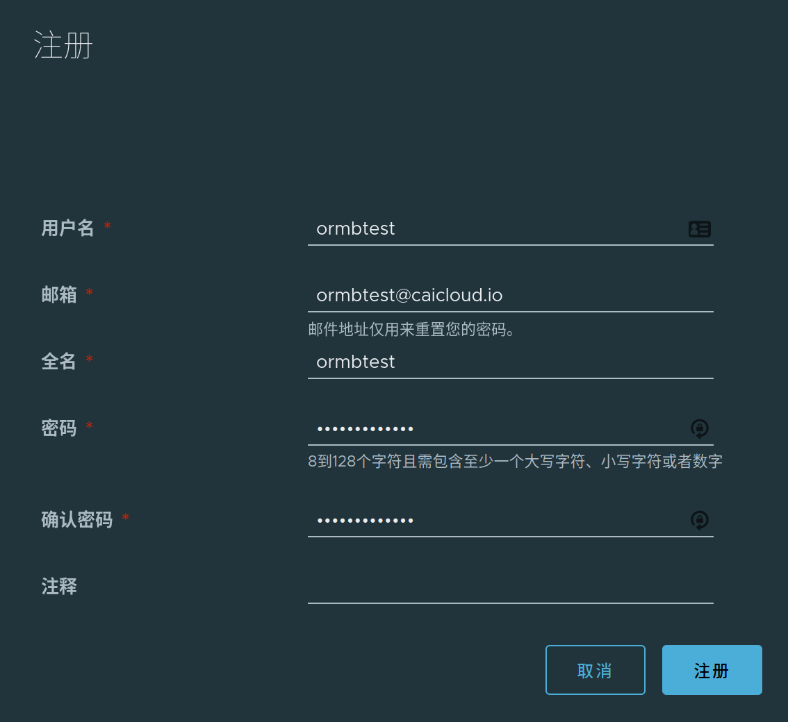
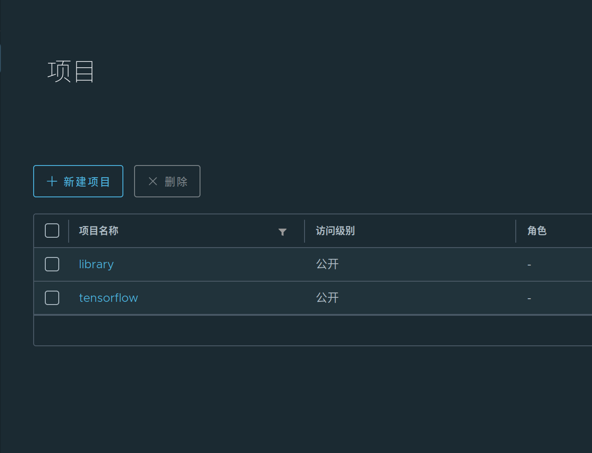
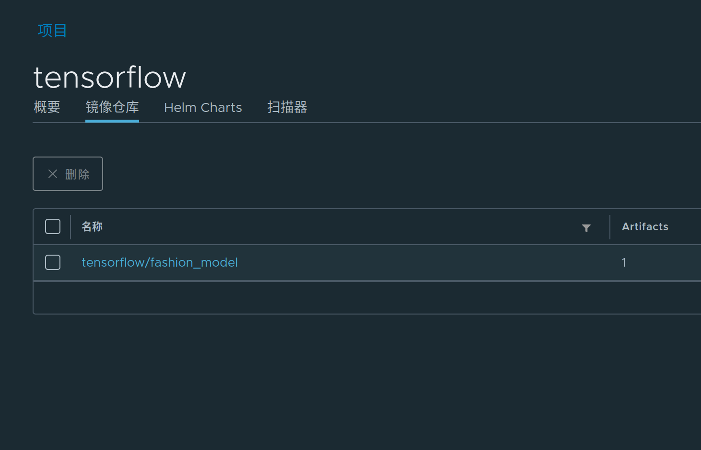

# Serving Models with Seldon Core and ormb (Experimental)

ormb can be used to pull models in Seldon Core. First we need to deploy Seldon Core on Kubernetes.

In this tutorial, we use [SavedModel-fashion](../examples/SavedModel-fashion) as an example, to illustrate the feature.

## Push the model to remote registry

In this tutorial, we use [demo.goharbor.io][] as the remote registry. First you need to register an account in [demo.goharbor.io][]. We use `ormbtest` as username, `ORMBtest12345` as password here.

<p align="center">

<p align="center">Harbor Registration</p>
</p>

Then, we should create a new project `tensorflow` in Harbor.

<p align="center">

<p align="center">https://demo.goharbor.io/harbor/projects</p>
</p>

After that, the model can be pushed to the remote registry under `tensorlfow` project.

```bash
# Login to demo.goharbor.io
$ ormb login demo.goharbor.io -u ormbtest -p ORMBtest12345
WARNING! Using --password via the CLI is insecure. Use --password-stdin.
Login succeeded
# Save the model to local cache.
$ ormb save ./examples/SavedModel-fashion demo.goharbor.io/tensorflow/fashion_model:v1
ref:       demo.goharbor.io/tensorflow/fashion_model:v1
digest:    13eb538942a70c699637cfa1bb9c7d72cd8430af50a992055b7bfd3220042e94
size:      162.1 KiB
format:    SavedModel
v1: saved
# Push the model to demo.goharbor.io
$ ormb push demo.goharbor.io/tensorflow/fashion_model:v1
ref:       demo.goharbor.io/tensorflow/fashion_model:v1
digest:    13eb538942a70c699637cfa1bb9c7d72cd8430af50a992055b7bfd3220042e94
size:      162.1 KiB
format:    SavedModel
v1: pushed to remote (1 layer, 162.1 KiB total)
```

Then we can get the model in the Harbor UI.

<p align="center">

<p align="center">Harbor Project UI</p>
</p>

## Deploy Seldon Core on Kubernetes

Then we can clone our own seldon-core fork and deploy it. We will contribute the implementation to upstream soon.

```bash
$ git clone git@github.com:gaocegege/seldon-core.git
$ git checkout ormb
$ cd ./operator
```

Follow the guide [here](https://docs.seldon.io/projects/seldon-core/en/latest/developer/readme.html) to deploy Seldon Core using kind.

## Create the SeldonDeployment

Then we can create the SeldonDeployment now.

```yaml
apiVersion: machinelearning.seldon.io/v1alpha2
kind: SeldonDeployment
metadata:
  name: tfserving
spec:
  name: mnist
  protocol: tensorflow
  predictors:
  - graph:
      children: []
      implementation: TENSORFLOW_SERVER
      modelUri: demo.goharbor.io/tensorflow/fashion_model:v1
      serviceAccountName: ormb
      name: mnist-model
      parameters:
        - name: signature_name
          type: STRING
          value: predict_images
        - name: model_name
          type: STRING
          value: mnist-model
    name: default
    replicas: 1
---
apiVersion: v1
kind: Secret
metadata:
  name: ormb
type: Opaque
data:
  # base64 formatted username `ormbtest`
  ormbUsername: b3JtYnRlc3Q=
  # base64 formatted password `ORMBtest12345`
  ormbPassword: T1JNQnRlc3QxMjM0NQ==
---
apiVersion: v1
kind: ServiceAccount
metadata:
  name: ormb
secrets:
  - name: ormb
```

We can get the pod like this.

```
$ kubectl get pods
NAME                                               READY   STATUS    RESTARTS   AGE
tfserving-default-0-mnist-model-85df66ccd4-spd4d   2/2     Running   0          149m
$ kubectl get svc
NAME                            TYPE        CLUSTER-IP       EXTERNAL-IP   PORT(S)             AGE
kubernetes                      ClusterIP   10.96.0.1        <none>        443/TCP             4h14m
tfserving-default               ClusterIP   10.103.195.134   <none>        8000/TCP,5001/TCP   173m
tfserving-default-mnist-model   ClusterIP   10.99.150.123    <none>        9000/TCP            173m
```

Then we can port-forward `tfserving-default` to port 8080 in the host.

```
kubectl port-forward service/tfserving-default 8000:8000
```

use the code in [examples/SavedModel-fashion/training-serving.ipynb](../examples/SavedModel-fashion/training-serving.ipynb) to test it.

```python
import tensorflow as tf
from tensorflow import keras

# Helper libraries
import numpy as np
import matplotlib.pyplot as plt
import os
import subprocess

fashion_mnist = keras.datasets.fashion_mnist
(train_images, train_labels), (test_images, test_labels) = fashion_mnist.load_data()

# scale the values to 0.0 to 1.0
train_images = train_images / 255.0
test_images = test_images / 255.0

# reshape for feeding into the model
train_images = train_images.reshape(train_images.shape[0], 28, 28, 1)
test_images = test_images.reshape(test_images.shape[0], 28, 28, 1)

class_names = ['T-shirt/top', 'Trouser', 'Pullover', 'Dress', 'Coat',
               'Sandal', 'Shirt', 'Sneaker', 'Bag', 'Ankle boot']

print('\ntrain_images.shape: {}, of {}'.format(train_images.shape, train_images.dtype))
print('test_images.shape: {}, of {}'.format(test_images.shape, test_images.dtype))

def show(idx, title):
  plt.figure()
  plt.imshow(test_images[idx].reshape(28,28))
  plt.axis('off')
  plt.title('\n\n{}'.format(title), fontdict={'size': 16})

import json
data = json.dumps({"signature_name": "serving_default", "instances": test_images[0:3].tolist()})
import requests
headers = {"content-type": "application/json"}
json_response = requests.post('http://localhost:8000/v1/models/mnist-model/:predict', data=data, headers=headers)
predictions = json.loads(json_response.text)['predictions']

show(0, 'The model thought this was a {} (class {}), and it was actually a {} (class {})'.format(
  class_names[np.argmax(predictions[0])], np.argmax(predictions[0]), class_names[test_labels[0]], test_labels[0]))
```

[demo.goharbor.io]: https://demo.goharbor.io/
